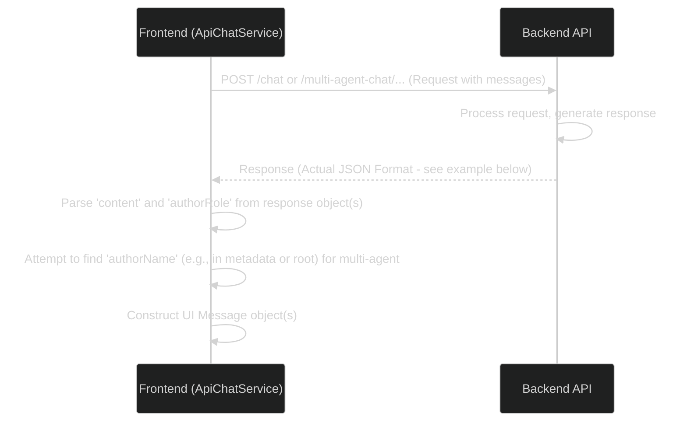

# API Communication Flow (Actual Response Format)

This diagram illustrates how the frontend (`ApiChatService`) interacts with the backend API and handles the actual JSON response format.



## Example API Response Structure

The frontend expects an array of objects, where each object represents a message. Key fields used by the frontend:

*   `content`: (String) The main text content of the message.
*   `authorRole`: (String, e.g., "ASSISTANT") The role of the message author.
*   `authorName`: (String, Optional) The name of the specific agent in multi-agent mode. *Note: The exact location of this field in the response needs confirmation, it might be at the root level or within `metadata`.*
*   `metadata`: (Object, Optional) Contains additional information, potentially including usage stats or agent identifiers.

```json
[
    {
        "innerContent": null,
        "metadata": { // Example nested metadata
            "metadata": { /* ... */ },
            "id": "chatcmpl-...",
            "usage": { /* ... */ },
            "createdAt": "..."
            // Potential location for authorName if not at root
        },
        "authorRole": "ASSISTANT", // Used for role
        "content": "Hello! How can I assist you today?", // Primary content field
        "items": null,
        "encoding": "UTF-8",
        "contentType": "TEXT",
        "toolCall": null
        // Potential location for authorName if not in metadata
    }
]
``` 