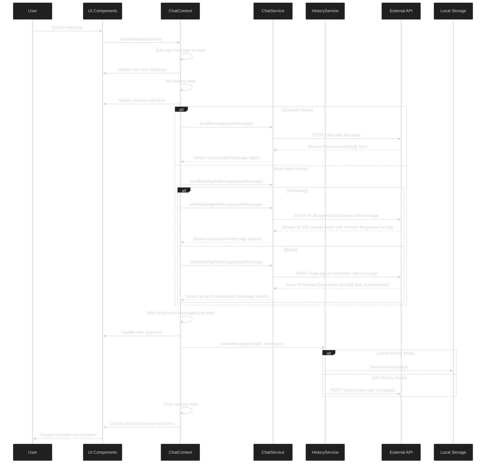

# Message Processing Flow

This sequence diagram shows the steps involved when a user sends a message, including standard vs. multi-agent logic, API/storage interactions, and loading state changes.

