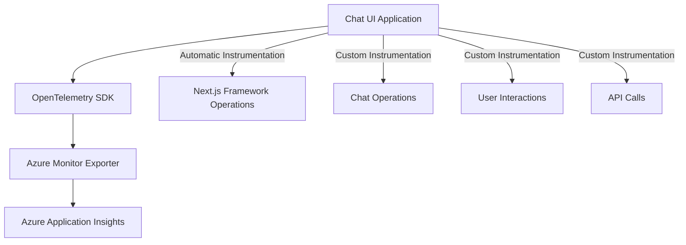

# OpenTelemetry Observability in Chat UI

This document describes the implementation of OpenTelemetry in the Chat UI application for monitoring and observability.

## Overview

OpenTelemetry is an open-source observability framework that provides standardized ways to collect and export telemetry data such as traces, metrics, and logs. In Chat UI, we use OpenTelemetry to:

1. Monitor application performance
2. Track user interactions
3. Measure API call performance
4. Diagnose issues in production
5. Understand user behavior patterns

## Implementation

### Architecture

The application uses the `@vercel/otel` package integrated with Azure Application Insights:



### Core Components

1. **instrumentation.ts**: Root file that initializes OpenTelemetry using `@vercel/otel`
2. **utils/telemetry.ts**: Utilities for custom instrumentation of chat operations
3. **Azure Monitor Exporter**: Sends telemetry to Azure Application Insights

### Configuration

OpenTelemetry is configured via environment variables in `.env.local`:

```
# Required: Azure Application Insights connection string
NEXT_PUBLIC_APPLICATIONINSIGHTS_CONNECTION_STRING=InstrumentationKey=your-key;IngestionEndpoint=https://your-region.in.applicationinsights.azure.com/

# Optional: Log level for OpenTelemetry (default: info)
OTEL_LOG_LEVEL=info  # Options: error, warn, info, debug, trace
```

## Custom Instrumentation

The application provides custom instrumentation for chat-specific operations:

### API Calls

```typescript
// Example of API call instrumentation
function sendApiRequest() {
  return trackApiCall(
    'chat_completion',
    async () => {
      // Actual API call...
      return response;
    },
    {
      'agent.mode': currentMode,
      'messages.count': messages.length
    }
  );
}
```

### User Interactions

```typescript
// Example of user interaction tracking
function handleSendMessage(content: string) {
  trackUserAction('send_message', {
    'content.length': content.length,
    'agent.mode': currentMode
  });
  
  // Actual message sending logic...
}
```

### Component Rendering

```typescript
// Example of component render tracking
function ChatMessagePanel() {
  // Track component render and get cleanup function
  const endTracking = trackComponentRender('ChatMessagePanel', {
    'messages.count': messages.length
  });
  
  // Call the cleanup function when component unmounts
  useEffect(() => endTracking, []);
  
  // Render component...
}
```

## Automatic Instrumentation

The Next.js framework automatically instruments several operations:

- Page load and navigation
- API routes execution
- Server-side rendering operations
- Data fetching operations
- Component lifecycle events

## Azure Application Insights

### Setup

1. Create an Azure Application Insights resource in the Azure Portal
2. Get the Connection String from the Overview page
3. Add the Connection String to your environment variables

### Dashboard and Alerts

Using Application Insights, you can:

1. Create custom dashboards to monitor application performance
2. Set up alerts for error rates and performance degradation
3. Analyze user flows and behavior
4. Track dependency performance
5. View end-to-end transaction details

## Best Practices

1. **Be selective with what you track**: Too much telemetry can be overwhelming and costly
2. **Use meaningful span names**: Make sure span names describe the operation clearly
3. **Add relevant attributes**: Add context to spans with attributes that help with analysis
4. **Clean up resources**: Always end spans when operations complete
5. **Handle errors gracefully**: Record errors but ensure telemetry doesn't affect the user experience

## Troubleshooting

If telemetry data doesn't appear in Azure Application Insights:

1. Check that the Connection String is correct
2. Set `OTEL_LOG_LEVEL=debug` to see detailed logs
3. Verify that the application is running in production mode
4. Check that the Azure Monitor Exporter is properly configured
5. Allow 2-3 minutes for data to appear in the Azure Portal

## Resources

- [OpenTelemetry Documentation](https://opentelemetry.io/docs/)
- [Azure Monitor OpenTelemetry](https://learn.microsoft.com/en-us/azure/azure-monitor/app/opentelemetry-overview)
- [Next.js OpenTelemetry](https://nextjs.org/docs/app/building-your-application/optimizing/open-telemetry)
- [@vercel/otel Documentation](https://vercel.com/docs/observability/otel-overview) 