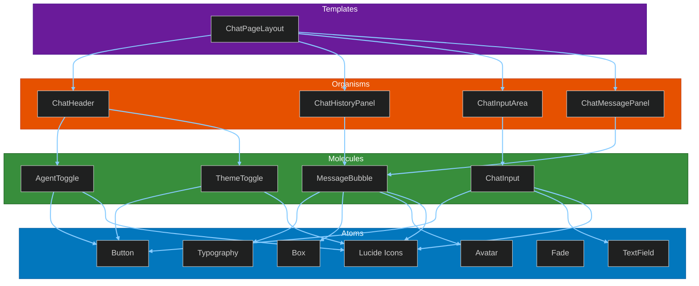
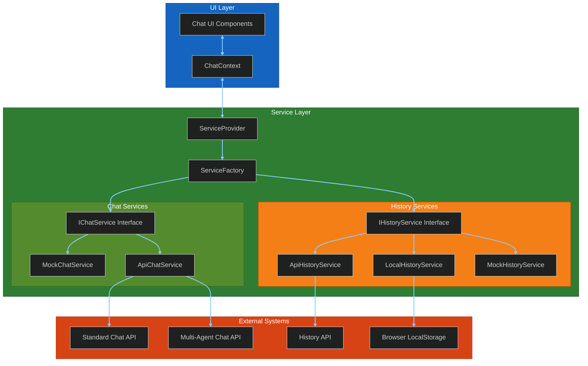
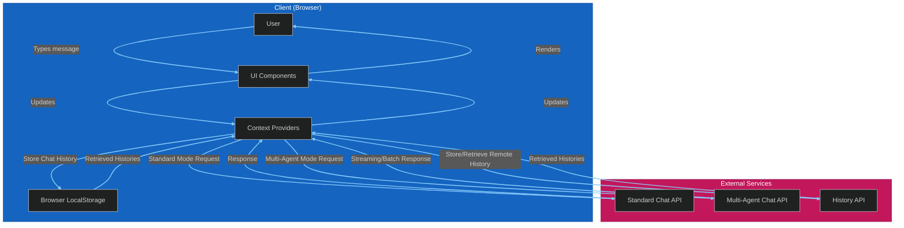
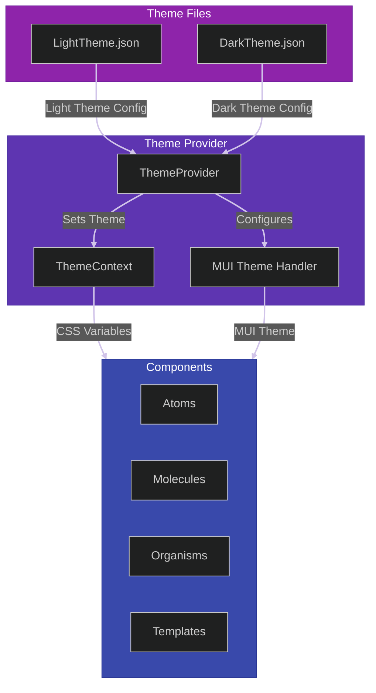
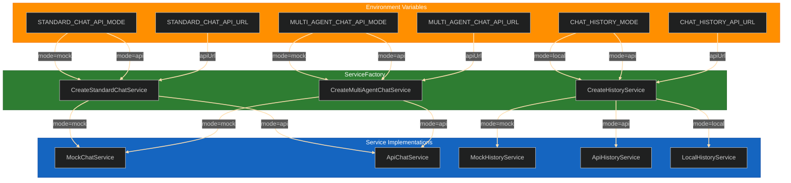
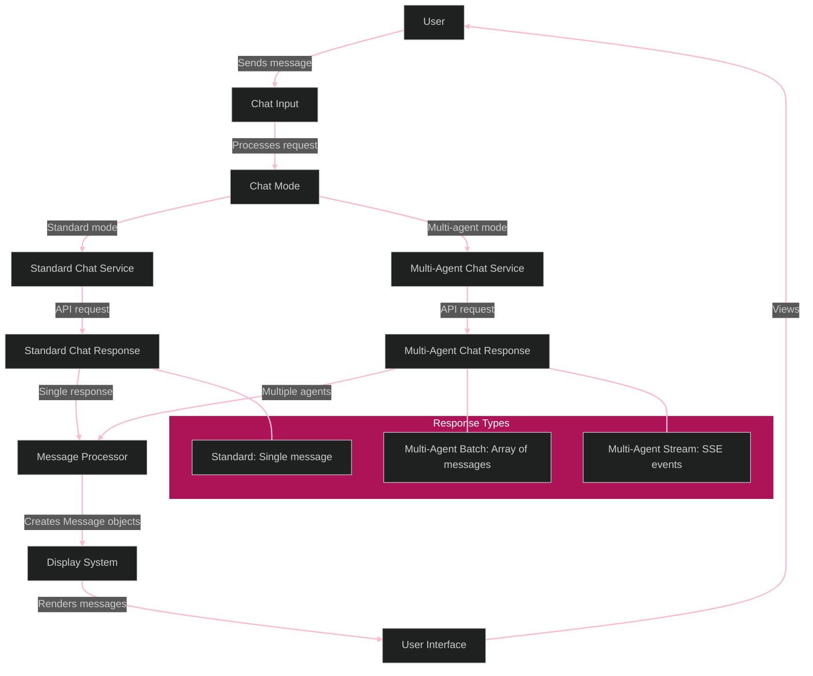
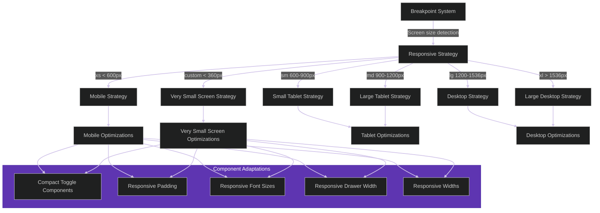
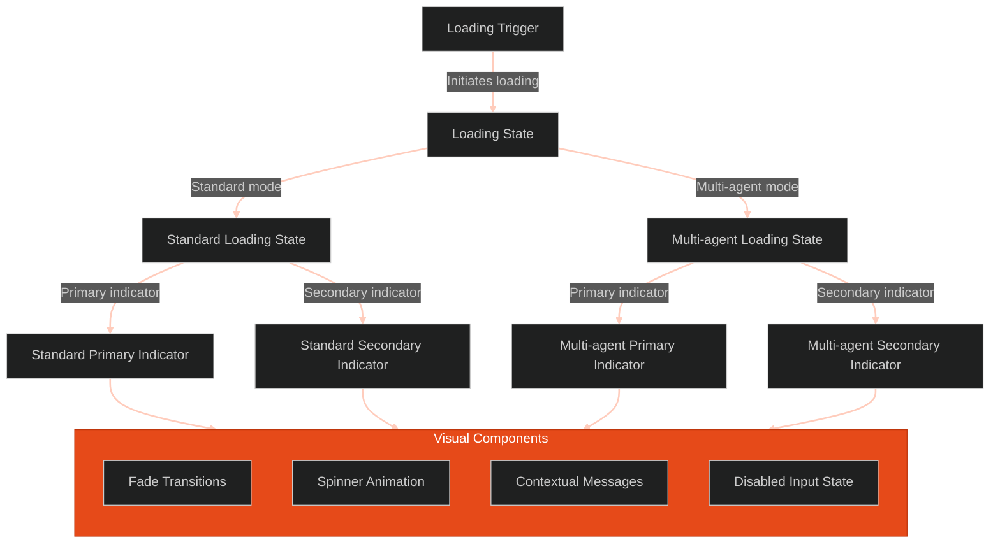
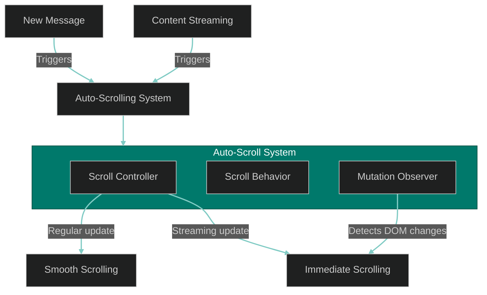
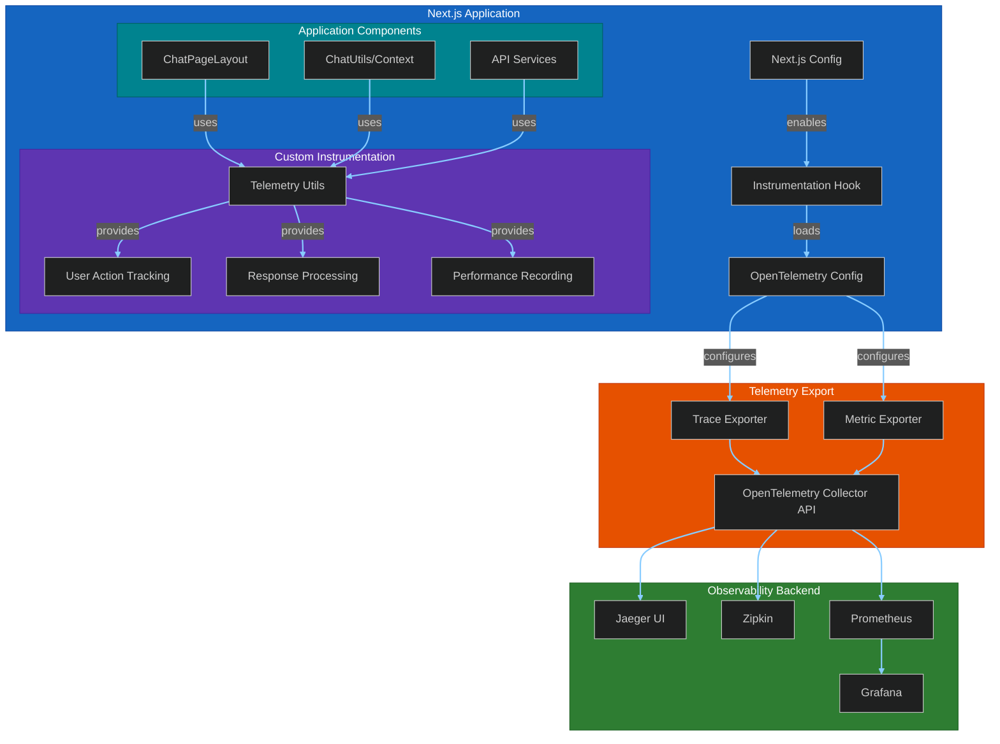

# Architecture Diagrams: ChatUI

This file contains Mermaid diagrams that visualize the architecture of the Chat UI application. These diagrams are intended to help various technical stakeholders understand the system structure and flow.

## 1. Component Architecture (Atomic Design)

## 2. Service Architecture

## 3. Data Flow Diagram

## 4. Theming System

## 5. Environment Configuration

## 6. Response Processing Flow

## 7. Responsive Design System

## 8. Loading State System

## 9. Auto-Scrolling System

## 10. OpenTelemetry Implementation

